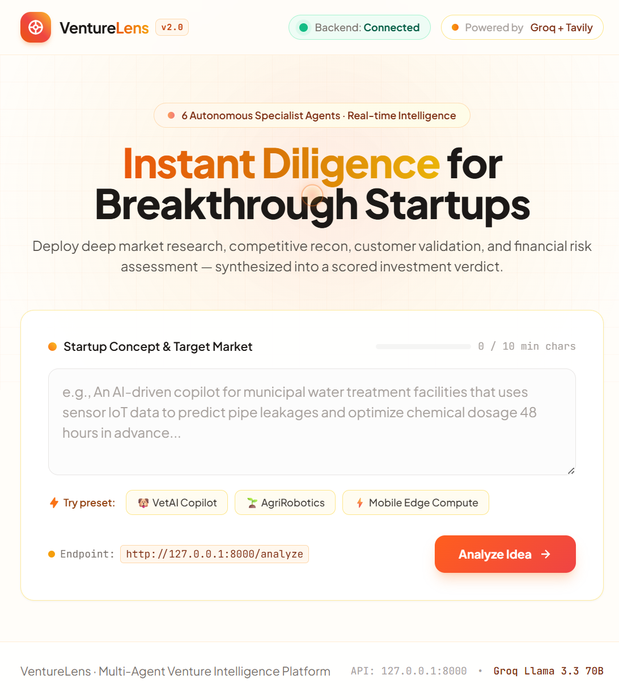
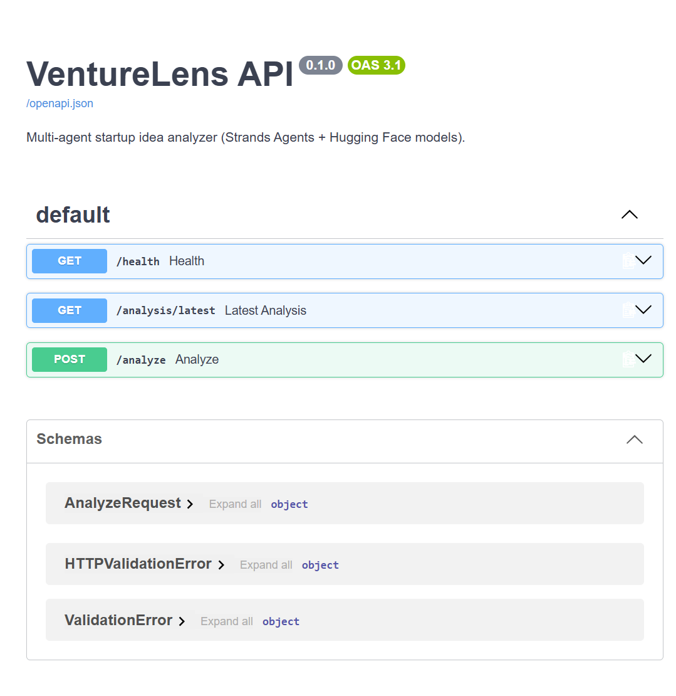

# VentureLens

VentureLens is a multi-agent startup due-diligence application. Enter a startup
idea in the browser and receive market, competitor, customer, business-model,
risk, and investment-verdict analysis from one backend pipeline.

The repository contains:

- A static browser frontend in `frontend/index.html`.
- A FastAPI backend in `backend/main.py`.
- Specialist analysis agents in `backend/agents/`.
- Tavily web search, local Hugging Face classifiers, deterministic finance
  calculations, and a configurable LiteLLM reasoning model.

## Screenshots

### Frontend



### Backend API documentation



## Current Status

The application currently runs locally over HTTPS:

| Service | URL |
|---|---|
| Frontend | https://127.0.0.1:5500 |
| Swagger API docs | https://127.0.0.1:8000/docs |
| Backend health | https://127.0.0.1:8000/health |
| Latest completed analysis | https://127.0.0.1:8000/analysis/latest |

The local HTTPS certificate is self-signed, so the browser will show a warning
the first time each local HTTPS address is opened. Accept the warning for local
development only.

## How It Works

```text
Browser submits startup_idea
              |
              v
        FastAPI /analyze
              |
              v
     Canonicalize and identify idea
              |
       Cached result available?
          /             \
        yes              no
         |                |
         v                v
  Return same result   Run pipeline once
                           |
        +------------------+------------------+
        |                  |                 |
     Market           Competitors        Customers
        |                  |                 |
        +------------------+-----------------+
                           |
                       Business
                           |
                          Risk
                           |
                       Synthesis
                           |
                    Save and return JSON
```

The pipeline is explicit Python code in `backend/orchestrator.py`. It does not
ask another model to decide which agents to run. The research stages currently
run sequentially to stay within provider rate limits.

### Analysis stages

1. **Market agent** searches for market size, trends, and timing.
2. **Competitor agent** searches for real competitors and alternatives.
3. **Customer agent** searches for customer problems and analyzes sentiment.
4. **Business agent** applies finance tools for unit economics, break-even,
   and growth scenarios, then writes the business assessment.
5. **Risk agent** researches regulatory issues and assesses market,
   competitive, execution, and financial risks.
6. **Synthesis agent** returns the score, recommendation, strengths, risks,
   assumptions, and plain-language summary.

## Why Repeated Ideas Return the Same Result

LLM responses and live search results can vary between runs. To prevent the
frontend and backend from showing different answers for the same idea, the
backend:

- Normalizes whitespace in the submitted idea.
- Creates a stable 16-character `analysis_id` from the idea.
- Stores completed results in `backend/.analysis_cache.json`.
- Returns the saved result for future equivalent submissions.
- Serializes analysis runs so concurrent duplicate requests do not create two
  different results.

The cache is local runtime data and is ignored by Git. To force a fresh result,
delete `backend/.analysis_cache.json` and submit the idea again.

## Technology

| Area | Technology used now |
|---|---|
| Frontend | HTML, JavaScript, Tailwind CDN, Marked.js |
| API | FastAPI, Pydantic, Uvicorn |
| Agent framework | Strands Agents SDK and Strands tool decorators |
| Reasoning model | LiteLLM provider selected by `MODEL_ID`, Groq by default |
| Web research | Tavily Search API |
| Local sentiment model | `cardiffnlp/twitter-roberta-base-sentiment-latest` |
| Local NER model | `dslim/bert-base-NER` |
| Financial calculations | Plain Python functions in `backend/tools/finance_calculator.py` |

The active reasoning provider is controlled by `MODEL_ID`. The default is
`groq/llama-3.3-70b-versatile`, but `.env` can select another LiteLLM model.

## AWS and Hackathon Requirements

AWS is **not currently used at runtime**. There is no Amazon Bedrock, Bedrock
AgentCore, Lambda, S3, DynamoDB, or AWS credential integration in this version.

The project does use the AWS-created Strands Agents SDK as a Python dependency.
That is different from deploying the application on AWS.

For the hackathon page shown in the project materials:

### Required submission items

- Project description explaining the problem and solution.
- Public source-code repository.
- README.
- Architecture diagram.
- Demo video up to five minutes.
- AWS Builder ID.

### Optional AWS work

For a stronger AWS-specific submission, the backend could later be deployed to
Amazon Bedrock AgentCore or the reasoning model could be moved to Amazon
Bedrock. Those are future deployment options, not requirements for the local
version documented here.

## Prerequisites

- Python 3.10 or newer.
- A Groq API key.
- A Tavily API key.
- Git and PowerShell on Windows, or an equivalent shell on macOS/Linux.

Optional:

- A Hugging Face token if `MODEL_ID` is changed to a Hugging Face model.
- An AWS Builder ID for hackathon submission.

## Configuration

Create the local environment file:

```powershell
Copy-Item .env.example .env
```

Then edit `.env`:

```dotenv
GROQ_API_KEY=your_groq_api_key
TAVILY_API_KEY=your_tavily_api_key
MODEL_ID=groq/llama-3.3-70b-versatile
HF_TOKEN=
HF_PROVIDER=
```

Never commit `.env` or paste API keys into source code, README files, or chat.

## Installation

From the repository root:

```powershell
python -m venv .venv
.venv\Scripts\Activate.ps1
python -m pip install --upgrade pip
pip install -r requirements.txt
```

The first analysis may download the local sentiment and NER model weights.
They are cached locally after the first successful download.

## Run Locally

### Run with Docker Compose

Make sure `.env` exists and contains valid `GROQ_API_KEY` and
`TAVILY_API_KEY` values, then run from the repository root:

```powershell
docker compose up --build
```

The containerized services are available at:

- Frontend: http://127.0.0.1:8080
- Swagger: http://127.0.0.1:8000/docs
- Health: http://127.0.0.1:8000/health
- Latest analysis: http://127.0.0.1:8000/analysis/latest

The backend cache is stored in the named Docker volume
`venturelens-cache`. Stop the services with:

```powershell
docker compose down
```

Remove the cache volume only when you intentionally want to delete saved
analyses:

```powershell
docker compose down -v
```

### Start the backend over HTTP

Use this simpler option for API-only development:

```powershell
python -m uvicorn backend.main:app --host 127.0.0.1 --port 8000
```

Backend URLs:

- http://127.0.0.1:8000/docs
- http://127.0.0.1:8000/health

### Start the backend over HTTPS

The frontend must use HTTPS when it calls an HTTPS backend. Create a local
certificate once from the repository root:

```powershell
New-Item -ItemType Directory -Force .dev-cert
openssl req -x509 -newkey rsa:2048 `
  -keyout .dev-cert\localhost.key `
  -out .dev-cert\localhost.crt `
  -days 30 -nodes -subj "/CN=localhost" `
  -addext "subjectAltName=DNS:localhost,IP:127.0.0.1"
```

Start the backend:

```powershell
python -m uvicorn backend.main:app --host 127.0.0.1 --port 8000 `
  --ssl-keyfile .dev-cert\localhost.key `
  --ssl-certfile .dev-cert\localhost.crt
```

### Start the frontend over HTTPS

In a second terminal from the repository root:

```powershell
python frontend\serve_https.py
```

Open https://127.0.0.1:5500 and submit an idea. The frontend is configured to
call `https://127.0.0.1:8000/analyze`.

## API

### `GET /health`

Checks whether the backend is running:

```json
{"status":"ok"}
```

### `POST /analyze`

Request:

```json
{
  "startup_idea": "An AI copilot for independent veterinary clinics that automates clinical note dictation, medical coding, and insurance claims."
}
```

Response fields:

```text
startup_idea
analysis_id
market_report
competitor_report
customer_report
business_report
risk_report
synthesis
elapsed_seconds
```

Example PowerShell request for the HTTPS backend:

```powershell
$body = @{
  startup_idea = "An AI copilot for independent veterinary clinics that automates clinical note dictation, medical coding, and insurance claims."
} | ConvertTo-Json

Invoke-RestMethod -SkipCertificateCheck `
  -Uri https://127.0.0.1:8000/analyze `
  -Method Post `
  -ContentType "application/json" `
  -Body $body
```

### `GET /analysis/latest`

Returns the most recently saved completed analysis. This is useful for checking
in Swagger that a result generated through the frontend reached the backend.

Open https://127.0.0.1:8000/docs, expand **GET `/analysis/latest`**, click
**Try it out**, and click **Execute**.

## Example Startup Ideas

```text
An AI copilot for independent veterinary clinics that automates clinical note dictation, medical coding, and insurance claims.
```

```text
Solar-powered autonomous weed-zapping micro-rovers for commercial organic berry farms to replace chemical spraying.
```

```text
Decentralized edge computing marketplace allowing smartphone users to rent idle NPU compute during overnight charging.
```

## Project Layout

```text
venturelens/
  backend/
    agents/
      business_agent.py
      competitor_agent.py
      customer_agent.py
      market_agent.py
      risk_agent.py
      synthesis_agent.py
    analysis_cache.py       # stable IDs and persistent result cache
    config.py               # environment configuration
    main.py                 # FastAPI endpoints
    orchestrator.py         # explicit multi-stage pipeline
    run_cli.py              # command-line runner
    utils.py                # rate-limit retry helper
    models/
      hf_model.py           # Strands-compatible LiteLLM model factory
    tools/
      finance_calculator.py
      ner_tool.py
      search_helper.py
      sentiment_tool.py
      web_search.py
  frontend/
    index.html              # browser application
    serve_https.py           # local HTTPS static server
  .env.example
  requirements.txt
  README.md
```

## Troubleshooting

### Frontend says the backend is offline

1. Confirm the backend is running on port `8000`.
2. Open https://127.0.0.1:8000/health and accept the certificate warning.
3. Confirm the frontend uses `https://127.0.0.1:8000`, not `http://`.
4. Check that `GROQ_API_KEY` and `TAVILY_API_KEY` are present in `.env`.

### Swagger does not show the frontend result

Swagger does not automatically display requests made from the browser. Use
**GET `/analysis/latest`** in Swagger to retrieve the latest saved result.

### Same idea appears to produce a new answer

The idea is normalized by whitespace and cached after completion. Delete
`backend/.analysis_cache.json` only when a fresh analysis is intentionally
needed.

### Rate-limit errors

The pipeline retries rate-limit failures with a delay. Wait for the retry cycle
to finish, reduce repeated test submissions, or select a provider/model with
more available quota.

## Security Notes

- The local HTTPS certificate is for development only.
- CORS is intentionally permissive for local development.
- Restrict CORS origins, use a trusted certificate, and move secrets to a
  managed secret store before production deployment.
- Do not expose the local cache if analysis results contain sensitive ideas.
